# TECH_DESIGN.md — 技术方案设计

> Day 5｜第 1 周｜Vibe Coding 训练营
> 本文件回答一个问题：**这套东西用什么做、为什么这么选、数据怎么流动。**
> 上游依据：`PRD.md`（Day 4 需求）＋ `research.md`（Day 3 路线研究）。
> 本文件**不做需求定义**（那是 PRD 的事），**不写代码**（那是 Day 7 的事）。

---

## 一、技术路线总表

每项写清三件事：**选什么 / 为什么选它 / 暂时不选什么**。

| 层面 | 选什么 | 为什么选它 | 暂时不选什么 |
|---|---|---|---|
| 后端框架 | **FastAPI**（Python） | 异步原生，正好贴合"等 AI 返回"的场景；AI 生态最成熟；自带交互式接口文档，Day 7 调试省事 | Django（对 MVP 过重，自带 ORM/Admin 用不上）；Flask（异步能力弱） |
| 前端呈现 | **Jinja2 模板** + 原生 HTML/CSS | 与后端同进程，不需要 Node 构建链、不产生前端依赖；F4 只要"列表 + 倒计时"，模板够用 | Next.js / React（对本项目是杀鸡用牛刀，Day 7 时间不够） |
| 数据库 | **SQLite** | 单机自用、零运维、单文件；Python 标准库自带，不用另装服务 | MySQL / PostgreSQL（要单独装服务、管账号密码，MVP 不需要） |
| AI 接入 | **DeepSeek `deepseek-chat`** | 便宜、中文强、接口兼容 OpenAI 格式、支持 JSON 结构化输出 | 通义千问（留作备选，接口差异小、切换成本低）；本地模型（要显卡、判断不稳） |
| 推送通道 | **Bark** | 一次 HTTP POST 即送达；免注册；可用公共服务器也可自建，可控性高 | Server酱（依赖第三方服务存续）；微信测试号（个人权限受限，实际会被挡） |
| 部署形态 | **本机运行 + 内网穿透**（方案 B） | 数据留在本地不交给云；穿透让手机在任何网络下都能把通知送到电脑，覆盖"人在外面"这一真实痛点 | 纯局域网（人一出门链路就断，产品价值残缺）；云服务器（要花钱 + 运维 + 数据上云） |
| 消息源 | **SmsForwarder**（现成工具，不属开发范围） | 安卓通知转发，是 research.md 里唯一不封号、无隐私风险的可行路线 | 读微信进程 / Hook / UI 自动化 / 数据库解密（墙砍，见 PRD 第五节） |

---

## 二、关键决策的展开说明

### 2.1 为什么是 DeepSeek

F2 要干的事是「语义分类 + 信息抽取」：把 12 条群消息分成重要/一般/闲聊，再抽出要点和截止时间。这个任务难度不高，主流国产模型都能胜任——所以选型关键不是"哪家最聪明"，而是三件事：

1. **便宜**：每条群消息都要过一次 AI，用量随消息量线性增长。DeepSeek 单价在国产模型里属最低一档，个人自用成本几乎可忽略。
2. **快且直连**：国内直连不需要代理，延迟低，满足 PRD F2-3「1 分钟内输出全部判断结果」。
3. **输出结构化**：必须支持 JSON 输出。因为 F3（推不推）和 F4（排时间线）要直接读 `importance / summary / deadline` 三个字段，**不能是一段自由文本**，否则还得写代码去"猜"模型想说什么。

**留的后路**：DeepSeek 接口兼容 OpenAI 格式。以后若要换模型（如通义千问），只需改 `base_url` 和 `model` 两处配置，业务代码不用动。

### 2.2 为什么是 Bark

PRD F3 的要求是"重要消息 1 分钟内到手机"，所以推送通道的核心指标是**送达速度**和**可控性**：

- Bark 一次 HTTP POST 就推到手机，端到端通常几秒，轻松满足"1 分钟"。
- 免注册、免公众号，不存在"个人订阅号没有模板消息权限"这类政策性堵塞（这正是微信测试号被否的原因）。
- 可先用公共服务器（`api.day.app`）零部署跑通，也可后续自建，进退都有空间。

**一个重要分工细节**：若采用公共 Bark 服务器，则「电脑 → 手机」这段推送走公网，**不需要穿透**；只有「手机 → 电脑」这一段才需要穿透。这样穿透的配置量减半。

### 2.3 为什么选方案 B，而不是更省事的纯局域网

Day 7 的验收标准只查功能，纯局域网（方案 A）其实也能过。选 B 是主动多花一点配置成本，换两样东西：

1. **覆盖真实场景**：这个产品解决的是"你顾不上刷群消息"的问题。人在家时你自己就能看手机；反而是**出门在外、手机与电脑不同网络**时才最需要提醒——而那恰恰是方案 A 断链的时刻。
2. **避免二次返工**：链路迟早要打通，现在一步到位，比 Day 7 上线后再回头改便宜。

**代价要写清楚**：多一个穿透工具要装要配，Day 7 的调试面变大（多一段网络链路可能出错）。

**降级预案**：若 Day 7 时间紧张，可先用局域网把 F1-F4 跑通，再把同一份代码接上穿透地址——**代码不变，只改配置**。这是 B 留的退路。

### 2.4 穿透工具候选（Day 7 实施时定）

| 工具 | 前提 / 优势 | 代价 |
|---|---|---|
| Cloudflare Tunnel（`cloudflared`） | 免费、自带 HTTPS、不需要自己买服务器 | 需要一个托管在 Cloudflare 的域名 |
| ngrok | 免费版即开即用、不需要域名，最适合先跑通 | 免费版随机域名、有连接数限制，重启后地址会变 |
| frp | 最可控、性能最好 | 需要一台有公网 IP 的服务器（与"数据不上云"的初衷冲突） |
| 国内穿透服务（花生壳 / natapp 等） | 有免费档、国内节点 | 限速，需实名 |

**选型原则**：本文件**只锁定"必须有穿透"这个结论，不锁定具体工具**。Day 7 按当时条件定：已有域名 → Cloudflare Tunnel；只想最快验证 → ngrok。

---

## 三、前后端与数据库分工

### 3.1 分工表

| 功能 | 前端负责 | 后端负责 | 是否落库 |
|---|---|---|---|
| **F1 消息接收与解析** | — | 提供接收端点，接住 SmsForwarder 转发的通知；解析出 `群名 / 发送人 / 内容 / 时间`；格式异常时不崩溃，标记为"解析失败" | ✅ 存 `messages` 表 |
| **F2 AI 重要性判断** | — | 调 DeepSeek API；输出三类（重要/一般/闲聊）+ 要点 + 截止时间；1 分钟内完成 12 条 | ✅ 存 `judgments` 表 |
| **F3 精选推送** | （设置项，MVP 可不做界面） | 监听 F2 结果，**只对"重要"项**调 Bark 推送；闲聊一条不推 | ❌ 不落库，只读 F2 结果 |
| **F4 待办时间线** | 时间线页面：按截止时间升序、剩余时间倒计时、无截止时间独立分组 | 提供时间线数据接口，聚合已判断为重要的项 | 读 `judgments` 表，**不额外建表** |

### 3.2 落库字段（设计约定，Day 7 才实现）

**`messages` — 接收到的消息记录**

| 字段 | 含义 |
|---|---|
| `id` | 主键 |
| `group_name` | 群名 |
| `sender` | 发送人 |
| `content` | 消息内容 |
| `received_at` | 接收时间 |
| `parse_status` | 解析状态：`ok` / `failed`（对应 PRD F1-3 验收） |

**`judgments` — AI 判断结果**

| 字段 | 含义 |
|---|---|
| `id` | 主键 |
| `message_id` | 关联 `messages.id` |
| `importance` | `important` / `normal` / `chat` |
| `summary` | 一句话要点 |
| `deadline` | 截止时间，可为空（对应 PRD F4-2「无时限」分组） |
| `judged_at` | 判断时间 |

> F4 时间线不单独建表：直接从 `judgments` 中筛 `importance = 'important'`，按 `deadline` 升序取出即可。

---

## 四、开发依赖预告（Day 7 才安装，今天不装）

| 依赖 | 用途 |
|---|---|
| `fastapi` + `uvicorn` | 后端框架与本地服务器 |
| `jinja2` | 页面模板渲染（F4 时间线页面） |
| `openai` | 调 DeepSeek API（兼容 OpenAI 格式） |
| `httpx` 或 `requests` | 调 Bark 推送接口 |

> 注意：按课程安排，**数据库配置等敏感信息在 Day 23 才引入 `.env`**，本阶段不提前处理。

---

## 五、待核实与风险项

| # | 风险项 | 影响 | 处理时机 |
|---|---|---|---|
| 1 | 微信通知内容有长度上限（受"通知显示消息详情"设置影响） | F1 解析完整度 | Day 7 前实测（PRD 第六节已记） |
| 2 | SmsForwarder 在目标机型上的保活稳定性 | 整体链路可用性 | Day 7 前实测 |
| 3 | **穿透地址的稳定性**：ngrok 免费版地址会变，频繁变动就要每次改 SmsForwarder 配置 | 链路可用性、维护成本 | Day 7 实施时定工具 |
| 4 | **Bark 公共服务可用性**：`api.day.app` 是第三方服务 | 推送可达性 | 长期使用可考虑自建 |
| 5 | **传输隐私**：群消息内容经穿透链路传输，若走 HTTP 明文则暴露在公网 | 隐私风险 | 优先选自带 HTTPS 的穿透方案（Cloudflare Tunnel / ngrok 均满足） |

---

## 附：本文件与其他文档的关系

```
research.md（Day 3）   →  讲"路能不能走通"
      ↓
PRD.md（Day 4）        →  讲"要做成什么样、什么算完成"
      ↓
TECH_DESIGN.md（Day 5，本文件） →  讲"用什么做、为什么这么选、数据怎么流动"
      ↓
Day 7 开发             →  按本文件落地代码
```

---

## 六、数据流图

本节回答核心问题：**数据从哪来 → 到哪去 → 在哪被加工**。



> 上面这张图标注了数据经历的所有节点。下面对关键流程做一次口头走查。

### 6.1 数据从哪来

1. **微信群消息** — 用户在群里发了一条消息（原文，未被任何系统处理）
2. **安卓通知栏** — 微信客户端把通知投到系统通知栏（系统能力，与本产品无关）
3. **SmsForwarder**（手机 App）— 监听通知栏、捕获微信通知、按配置转发。**本产品不开发这一步**，复用现成开源工具
4. **经穿透地址（HTTPS）** — SmsForwarder 把通知内容以 HTTP POST 发到公网可达的电脑后端地址。这是方案 B（本机 + 内网穿透）这一节的关键环节

### 6.2 在哪被加工（后端内部四步）

| 步骤 | 节点 | 数据形态变化 | 对应验收 |
|---|---|---|---|
| 1 | **F1 接收解析** | 原始文本 → `{群名, 发送人, 内容, 时间, 状态}` | F1-1 / F1-2 |
| 2 | **messages 表**（SQLite） | 解析结果落库 | F1-3（异常不崩溃） |
| 3 | **F2 AI 判断**（DeepSeek） | 调大模型 → `{importance, summary, deadline}` | F2-1 / F2-2 |
| 4 | **judgments 表**（SQLite） | 判断结果落库，供 F3 / F4 消费 | — |

> 闲聊（`importance='chat'`）在 F2 出口处直接丢弃——不进入 judgments、不推、不上时间线。

### 6.3 数据到哪去

数据经后端加工后，**有两条出口**，都只在判定为 `important` 时触发：

| 出口 | 路径 | 触发条件 | 终端 | 验收 |
|---|---|---|---|---|
| **F3 推送** | F3 触发 → Bark Server → 手机 Bark App | 仅 `importance='important'` | 手机通知 | F3-1 / F3-2 / F3-3 |
| **F4 时间线** | F4 接口聚合 `important` 项 → 时间线页面 | 同上 | 手机浏览器 | F4-1 / F4-2 / F4-3 / F4-4 |

### 6.4 一句话复述（今天要掌握的核心）

> **「微信群消息 → 安卓通知栏捕获 → SmsForwarder 转发 → 经穿透地址进电脑后端 → F1 解析写 messages → F2 调 DeepSeek 判断写 judgments → 只把 important 一路推 Bark 到手机 App、一路聚合到 F4 时间线页面」**

能用自己话复述这一句，今天的核心目标就算达成。

### 6.5 图的精简 ASCII 降级版（编辑器不支持 SVG 渲染时备查）

```
[微信群] → [安卓通知栏] → [SmsForwarder] ──经穿透地址（HTTPS）──→ ┌─ 后端 FastAPI ──────────────┐
                                                                        │ F1 接收解析 → messages 表 │
                                                                        │        ↓                  │
                                                                        │ F2 AI 判断 → judgments 表 │ ──→ [F4 时间线接口] ──→ [手机浏览器]
                                                                        │        ↓                  │
                                                                        └──────────────────────────┘ ──→ [F3 推送触发] ──→ [Bark Server] ──→ [手机 Bark App]
```

---

## 七、多人轻量化路线（单 App 内置）

> Day 8 之后讨论确定。目标：让用户轻便化，最好「只装一个 App」。本节只定方向、不写代码（训练营范围外）。

### 7.1 核心结论

- **个人微信群场景下，零安装不可达。** 微信对个人号不开放任何读取群消息的 API，云端再强也伸不进个人微信群；捕获必须靠手机端组件。
- **用户侧地板 = 1 个捕获 App + 扫码绑定。** 把捕获、转发、本地提醒、绑定四件事全收进同一个 App，用户视角只剩「安装 → 扫码 → 完」。Bark 被云端 Web Push / 应用内本地通知替代，SmsForwarder 被内置捕获替代，手填配置被扫码替代。
- **唯一能到零安装的前提是换平台**：消息源迁到企业微信 / 飞书 / Telegram / Discord（均有开放 bot API），云端 bot 直接读群消息，用户什么 App 都不用装。

### 7.2 单 App 内置方案（个人微信场景的最轻形态）

一个安卓 App 内置四块，云端复用现有脑子（F1/F2/F4 + Day 8 卡片组件一字不改）：

| App 内置模块 | 职责 |
|---|---|
| 通知监听·捕获 | `NotificationListenerService` 读微信通知栏 |
| 转发到云端 | 带用户 token 的 HTTP POST 到后端 |
| 本地提醒（替 Bark） | 收到「important」回传后在应用内弹本地通知 |
| 扫码绑定 | 扫网页端二维码 → 拿到 token，免去手填地址 |

云端侧：`解析 F1` / `判断 F2` / `存储` / `Web Push 回传` 全部复用，不做新开发。

### 7.3 三条硬约束（决定此路能不能走）

| # | 约束 | 含义 / 应对 |
|---|---|---|
| 1 | **该 App 是原生安卓，不在当前 Python/FastAPI 栈** | 捕获靠 `NotificationListenerService`，只能用 Kotlin/Java 写；这是整条多人路线里最大的一块新开发。好消息：云端 F1/F2/F4 与 Day 8 组件（`app/static/js/message-card.js`、`timeline.html` 四状态）全部直接复用 |
| 2 | **iOS 禁止读他 App 通知 → 此方案仅 Android 可用** | iPhone 用户无法用单 App 捕获；只能换平台（企微/飞书，零安装）或暂不可用 |
| 3 | **权限红利换不掉** | App 须获「通知读取权限」并加入电池白名单（保活）；否则后台被杀即漏消息。个人微信天然代价，架构消不掉 |

### 7.4 与自用版（Day 5 方案 B）的差异速查

| 维度 | 自用版（当前） | 单 App 多人版 |
|---|---|---|
| 消息捕获 | SmsForwarder（独立 App） | 内置进同一 App |
| 推送通道 | Bark（独立 App） | 应用内本地通知 / Web Push |
| 绑定方式 | 手填穿透地址 | 扫码一键绑定 |
| 数据归属 | 无（单人） | 每行带 `user_id`，查询强制过滤 |
| 部署 | 本机 + 内网穿透 | 云服务器 + HTTPS（Day 5 的穿透决策作废） |
| 复用部分 | — | F1/F2/F4、Day 8 卡片组件、四状态 |

### 7.5 MVP 原则（本次讨论锚定）

> **先把流程跑通、能跑起来，后续再优化。** 单人版（本机 + 穿透 + mock→真接口）先按训练营节奏做完；多人单 App 路线等单人版跑稳、第 3 周真接口接上后再动手。新增开发集中在手机端那一个 App，云端脑子不动。

### 7.6 范围与边界

- 本路线**在训练营当前范围外**，本节仅固化方向，不写代码、不建仓库分支。
- 待第 3 周接真实 API、单人版闭环后，回头扩多人版有据可依。
```
